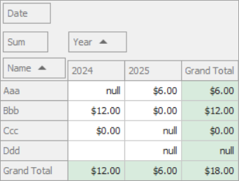

# Pivot Grid for WinForms - Differentiate Between Null (DBNull, Nothing) and "0" (Zero) Values

Use the  [`CustomCellDisplayText`](https://docs.devexpress.com/WindowsForms/DevExpress.XtraPivotGrid.PivotGridControl.CustomCellDisplayText) event to differentiate between null and zero values. Iterate through the collection of underlying data source rows to get actual data before summarizing values.
Use the [`CreateDrillDownDataSource`](https://docs.devexpress.com/CoreLibraries/DevExpress.XtraPivotGrid.PivotCellEventArgsBase-3.CreateDrillDownDataSource) method to get data records.

## Files to Review

* [Form1.cs](./CS/WindowsApplication53/Form1.cs) (VB: [Form1.vb](./VB/WindowsApplication53/Form1.vb))
* [Program.cs](./CS/WindowsApplication53/Program.cs) (VB: [Program.vb](./VB/WindowsApplication53/Program.vb))
